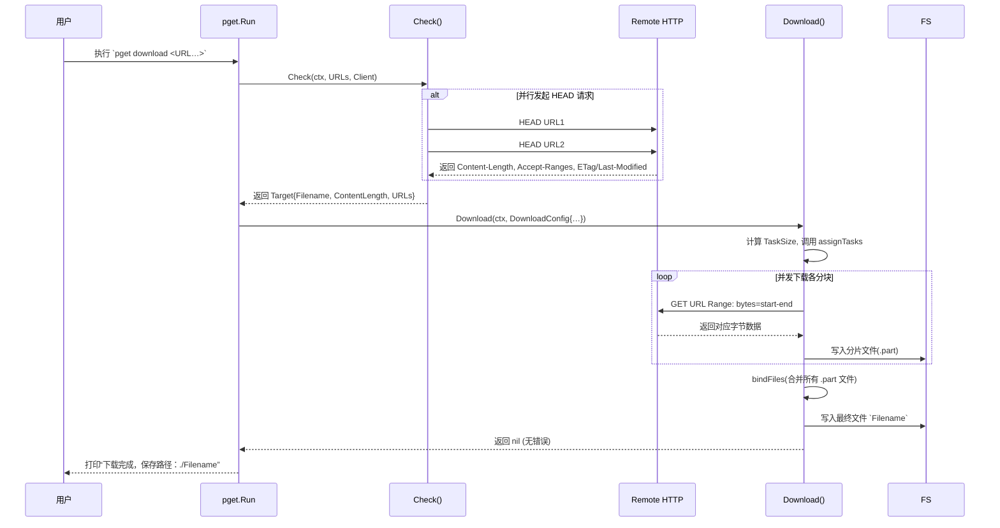

# pget 下载器

## 使用

基于原版添加了代理功能，可以通过指定代理来下载文件 `pget -x http://127.0.0.1:7897 URL`

```shell{10}
Pget v1.0-2-gae9a8cf, The fastest file download client
Usage: pget [options] URL
  Options:
  -h,  --help                   print usage and exit
  -p,  --procs <num>            the number of connections for a single URL (default 1)
  -o,  --output <filename>      output file to <filename>
  -t,  --timeout <seconds>      timeout of checking request in seconds (default 10s)
  -u,  --user-agent <agent>     identify as <agent>
  -r,  --referer <referer>      identify as <referer>
  -x,  --proxy                  http(s) proxy URL, e.g. http://127.0.0.1:7897
  --check-update                check if there is update available
  --trace                       display detail error messages
```

**下载：**
- 原版（无代理功能）：https://github.com/Code-Hex/pget
- 有代理功能的版本：https://github.com/howard12358/pget ，其他版本请自行编译

## 设计

### 为什么没有下载多个 (不同) 链接的功能？

主要原因在于 pget（以及很多“多线程加速下载”工具）设计时，是把重点放在 **单个大文件** 的加速上，而不是批量下载多个文件。具体来说：pget 的**设计定位是单文件分段并发**

- pget 核心功能是对同一个 URL 发起多个并行请求（HTTP Range），把一个大文件拆成很多小段同时下载，然后再合并。这能大幅提高对单个大文件的下载速度。
- 而“同时下载多个文件”这种场景，更多是把一个 URL 列表当队列，串行或简单并发地消费。这个需求在脚本级别（Bash、PowerShell）里很容易实现，也有专门的批量下载工具（比如 wget 本身就可以通过 `-i list.txt` 串行下载、aria2 可以通过 `--max-concurrent-downloads` 做并发队列），所以 pget 并没有把它当核心功能来做。

### 通过多个镜像链接下载这个功能有什么用？

**镜像下载（multi‑mirror）的场景**

- pget 里支持的“多个镜像 URL”功能，它是为了 **可靠性和速度** 而设计的：当一个大文件在不同服务器／CDN 上有多个镜像时，pget 可以把各个分段请求分配到不同镜像上取，既能提高带宽利用率，也能保证某个镜像临时挂掉时由另外的镜像补下载。
- 这类功能常见于 Linux 发行版 ISO、软件安装包、视频素材大文件的多源分发。厂商会在全球布置若干镜像站点，用户拿到一个“镜像列表”，pget 就能同时从多个站点拉取不同区间的数据。

## 时序图


::: details mermaid

:::
